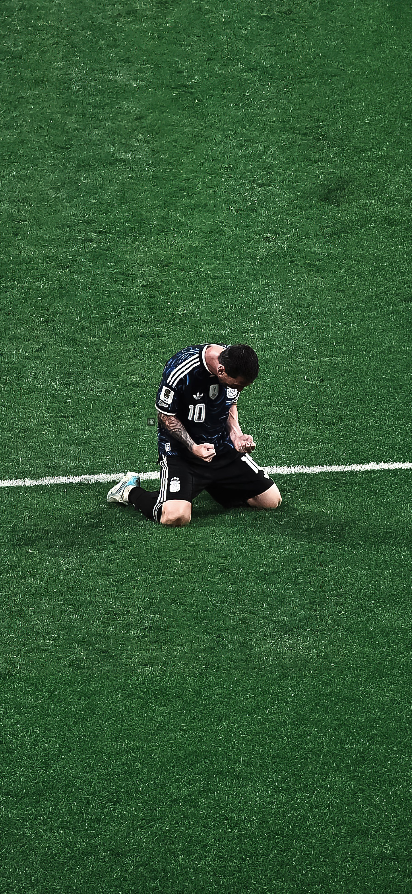

# Image to Greyscale Converter

A simple command-line application written in Go that converts a color image into a grayscale image using the standard luminance formula.


## Grayscale Formula

The grayscale intensity is calculated using the standard luminance equation:

```text
Gray = 0.299 × R + 0.587 × G + 0.114 × B
```

## Project Structure

```
.
├── main.go
├── messi-1.jpeg
├── messi-1-output.png
├── go.mod
└── README.md
```

## Usage

Run the application by providing the image path as a command-line argument.

```bash
go run . messi-1.jpeg
```

Or build a binary:

```bash
go build -o grayscale
```

Then run:

```bash
./grayscale messi-1.jpeg
```

The output image will be saved alongside the input image with the suffix `-output.png`.

Example:

```
messi-1.jpeg
↓
messi-1-output.png
```

## Example

### Original Image



### Grayscale Output


## License

MIT